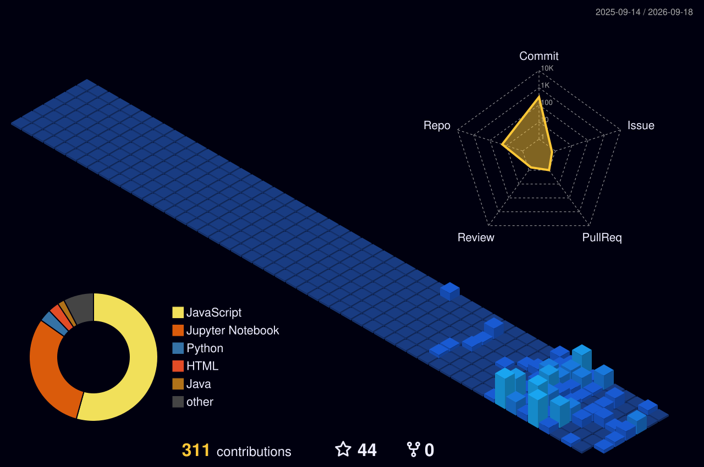

  

<h3 align="center">Computer Science & Engineering Student @ Barak Valley Engineering College 🚀</h3>

  
  
  
  <!-- Profile Views Counter -->
  

 

<table align="center" width="100%">
  <tr>
    <td align="left" width="50%">
      <h3>👨‍💻 About Me</h3>
      <ul>
        <li>🔭 5th-semester CSE student building end-to-end intelligent systems.</li>
        <li>🧠 Focus: <b>Machine Learning, Full-Stack Dev, & Cybersecurity.</b></li>
        <li>💡 Experienced in NLP pipelines and interactive 3D web environments.</li>
        <li>🎓 Active OSINT explorer analyzing digital footprints.</li>
        <li>⚡ Fun Fact: I'm an active FIDE-rated chess player and event organizer!</li>
      </ul>
    </td>
    <td align="center" width="50%">
      <h3>🛠️ Tech Stack & Tools</h3>
      
    </td>
  </tr>
</table>

 

### 🏆 GitHub Trophies

  

 

### 📊 Real-Time GitHub Metrics

<table align="center">
  <tr>
    <td align="center">
      
    </td>
    <td align="center">
      
    </td>
  </tr>
  <tr>
    <td align="center" colspan="2">
      
    </td>
  </tr>
</table>

 

### 📈 GitHub Activity Graph

  

 

### 🧊 3D Contribution Graph

  <!-- Generated by yoshi389111/github-profile-3d-contrib Action -->
  

 

### 🐍 Contribution Graph Snake Animation

  <!-- Generated by Platane/snk Action -->
  <picture>
    <source media="(prefers-color-scheme: dark)" srcset="https://raw.githubusercontent.com/rajtilakchamlagain/rajtilakchamlagain/output/github-contribution-grid-snake-dark.svg">
    <source media="(prefers-color-scheme: light)" srcset="https://raw.githubusercontent.com/rajtilakchamlagain/rajtilakchamlagain/output/github-contribution-grid-snake.svg">
    
  </picture>

 

---

  <i>"Writing clean, scalable code and delivering premium digital experiences."</i>

